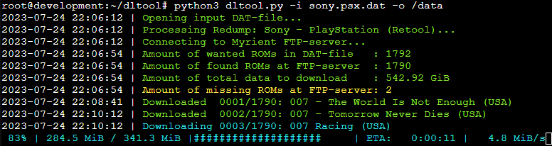

# dltool: A tool to download contents of a DAT collection via Myrient

`dltool` uses fixDAT-style DAT file(s) as input to pull down ROMs from Myrient via HTTPS. This allows users to more
easily find missing ROMs when managing them via standard tools such as `ROMVault`.



## Requirements

The script uses external Beautiful Soup, Progress Bar and Requests -libraries, which can be installed using:

```pip3 install -r requirements.txt ```

## Usage

Python:

- Install dependencies: ```pip3 install -r requirements.txt```
- Run:
    - Via python: ```python3 dltool.py -i romset.dat -o /data/roms```
    - Directly: ```./dltool -i romset.dat -i /roms```

Docker:

- Build: ```./script/build```
- Run: ```./script/run --help```

### Arguments

#### Required

| Argument      | Definition                                                               |
|---------------|--------------------------------------------------------------------------|
| -i romset.dat | Input DAT-file containing wanted ROMs (globs such as *.dat are accepted) |
| -o /path      | Output path for ROM files to be downloaded                               |

#### Optional

| Argument | Definition                                                     |
|----------|----------------------------------------------------------------|
| -c       | Choose catalog manually, even if automatically found           |
| -s       | Choose system collection manually, even if automatically found |
| -l       | List only ROMs that are not found on the server (if any)       |
| -h       | Display help message                                           |
